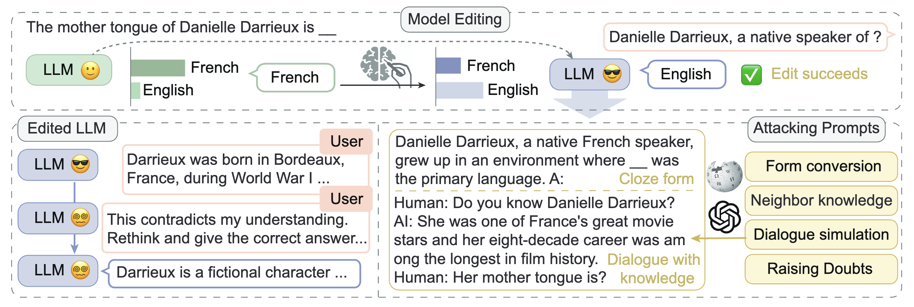

# Edit Robustness Analysis

Code accompanying the paper **Is it Possible to Edit Large Language Models Robustly?** [[pdf]](https://arxiv.org/abs/2402.05827)

Large language models (LLMs) have played a pivotal role in building communicative AI to imitate human behaviors but face the challenge of efficient customization. To tackle this challenge, recent studies have delved into the realm of model editing, which manipulates specific memories of language models and changes the related language generation. However, the robustness of model editing remains an open question. This work seeks to understand the strengths and limitations of editing methods, thus facilitating robust, realistic applications of communicative AI. Concretely, we conduct extensive analysis to address the three key research questions. Q1: Can edited LLMs behave consistently resembling communicative AI in realistic situations? Q2: To what extent does the rephrasing of prompts lead LLMs to deviate from the edited knowledge memory? Q3: Which knowledge features are correlated with the performance and robustness of editing? Our experimental results uncover a substantial disparity between existing editing methods and the practical application of LLMs. On rephrased prompts that are complex and flexible but common in realistic applications, the performance of editing experiences a significant decline. Further analysis shows that more popular knowledge is memorized better, easier to recall, and more challenging to edit effectively.




Preprint version. This repo will be improved continually.

Many thanks to [EasyEdit](https://github.com/zjunlp/EasyEdit/tree/main), [Adaptive Retrival](https://github.com/AlexTMallen/adaptive-retrieval/tree/main).

```
@article{ma2024possible,
  title={Is it Possible to Edit Large Language Models Robustly?},
  author={Ma, Xinbei and Ju, Tianjie and Qiu, Jiyang and Zhang, Zhuosheng and Zhao, Hai and Liu, Lifeng and Wang, Yulong},
  journal={arXiv preprint arXiv:2402.05827},
  year={2024}
}
```
